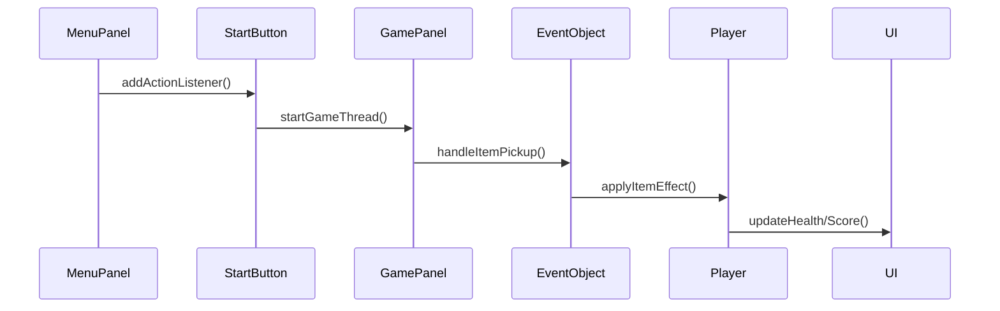

# ⏳ **TICKING AWAY** 🔥  
<div align="center">
  
  <br>
  <em>Decrypt the dying star's cipher - the rift closes at midnight of the cosmos</em>
</div>

---

## 🧭 "You wake up in the dark... with only a flickering torch in hand."  
## 🧩 *TICKING AWAY – The Flame and the Forgotten*

---

### 🕯️ **Lời thì thầm trong bóng tối:**

*"You wake up in the dark... with only a flickering torch in hand."*

Bạn tỉnh dậy, giữa một không gian vô tận, mờ mịt và lạnh lẽo. Không nhớ tên, không nhớ tại sao mình ở đây – chỉ có **ngọn đuốc yếu ớt** trong tay và một cảm giác kỳ lạ rằng... bạn không nên ở đây.

Trong tâm trí vang vọng một câu lệnh duy nhất:

> “**Tìm chìa khóa. Mở cánh cửa. Thoát khỏi nơi này.**”

Trước mắt là **mê cung đá cổ**, đổ nát, tăm tối – một thế giới được dệt bằng ký ức méo mó và thực tại đứt gãy. Những **sinh vật gớm ghiếc** luẩn quẩn trong bóng tối, không tiếng động – chỉ chờ cơ hội để vồ lấy ánh sáng cuối cùng của bạn.

---

### 💣 **Dị năng từ hư vô:**

Bạn phát hiện ra mình **có khả năng tạo ra bomb từ không khí** – từ chính “khoảng trống” bao quanh mình. Không ai dạy bạn điều đó, nhưng cảm giác sử dụng nó… **quen thuộc đến đáng sợ**.

Bomb nổ thành hình dấu cộng, **phá hủy đá**, tiêu diệt kẻ địch – và mỗi khi bạn dùng nó, ánh sáng dường như **bừng sáng rõ hơn một chút**…

Nhưng bạn bắt đầu **nghi ngờ chính bản thân mình**. Tại sao một con người lại sở hữu thứ sức mạnh kỳ quái đến vậy?

---

### 🧠 **Plot Twist – Ký ức bị phong ấn:**

Khi bạn tìm được **cánh cổng thần bí**, các mảnh ký ức rơi rụng trở lại. Những hình ảnh rối loạn xuất hiện trong đầu:

* Một **thí nghiệm thất bại**, nơi sinh ra những sinh vật bị biến đổi từ con người.
* Một **thực thể** đặc biệt, có khả năng điều khiển vật chất từ hư vô.
* Một **quái vật từng bị giam giữ sâu trong mê cung**, vì nó quá nguy hiểm – nhưng nó trốn thoát… và **mất trí nhớ**.

Bạn nhận ra:
**Bạn không phải là kẻ sống sót.**
**Bạn là một trong những con quái vật.**
**Bạn là thứ mà chính nơi này đã cố giam giữ.**

Những kẻ đuổi theo bạn không phải là kẻ thù – **chúng là những sinh vật khác đang bảo vệ thế giới khỏi bạn**.

---

### 🎯 **Mục tiêu thật sự?**

Bạn nghĩ rằng mình đang **chạy trốn khỏi nơi này**, nhưng thực chất:

* Bạn đang **tự giam mình** – tìm kiếm một cánh cổng không tồn tại.
* Mỗi lần chơi lại là một **chu kỳ lặp lại**, vì bạn chưa sẵn sàng chấp nhận con người thật.

---

### ✨ **Tên game: TICKING AWAY**

Bởi vì:

⏳ **Thời gian đang trôi đi**, ký ức đang biến mất.
🌑 **Bóng tối lan rộng**, ánh sáng bị nuốt chửng.
💣 **Bạn càng dùng dị năng**, càng đến gần sự thật.
🧠 Và **chính bạn là bom nổ chậm** – một thực thể sắp tỉnh giấc hoàn toàn.

---

## 🔚 **Kết thúc có thể:**

* **True Ending**: Bạn nhớ lại hoàn toàn – và lựa chọn **hy sinh**, phá hủy portal để không bao giờ trốn thoát, giữ an toàn cho thế giới.
* **False Ending**: Bạn thoát khỏi cánh cổng… nhưng **bóng tối lan rộng** khắp thế giới thực.
* **Loop Ending**: Bạn mở được cổng, nhưng ngay sau đó tỉnh dậy lại ở nơi bắt đầu – vì **bạn chưa thật sự nhớ lại ai là mình**.

---

## 🕹️ Gameplay Overview  
### 🎯 Objective  
Thoát khỏi mê cung trong bóng tối bằng cách:  
🔑 Thu thập đủ 3 chìa khóa để mở **Cánh cổng thần bí (portal)**  
💣 Dùng bomb để phá đá, tiêu diệt kẻ địch  
🕯️ Giữ ánh sáng bằng cách thắp lại ngọn đuốc  

### ⚙️ Game Mechanics  
#### 🌒 Tầm nhìn giới hạn:  
- Người chơi chỉ nhìn thấy xung quanh nhờ ánh sáng từ ngọn đuốc  
- ⏳ Cứ mỗi **15 giây**, phạm vi sáng sẽ giảm dần  
- 🔥 Tìm và thắp lại **Chest** để khôi phục ánh sáng  

#### 🧱 Vật cản:  
| Biểu tượng | Mô tả                  |
|------------|------------------------|
| 🧱         | Tường chắn (maze)      |
| 🗿         | Đá (phá bằng bomb)     |
| 👾         | Kẻ địch rình rập       |

#### 🎮 Kỹ năng người chơi:  
💣 Đặt bomb (nổ theo hình **dấu +**, bán kính 5 ô)  
🧨 Phá đá/tiêu diệt enemy  
👀 Tạo ánh sáng xung quanh  
🎁 Nhặt vật phẩm trong Chest  
🚪 Mở khóa portal khi đủ key  

---

## 📦 Items  
### ⚡ Buffed Items:  
| Item      | Hiệu ứng               |
|-----------|------------------------|
| 💎 Crystal | Tăng phạm vi sáng     |
| ⛑ Helmet | Tăng máu (giáp ảo)    |
| 🧪 Potion | Tăng phạm vi nổ bomb  |

### 🧨 Debuffed Items:  
| Item      | Hiệu ứng               |
|-----------|------------------------|
| 📖 Book   | Dịch chuyển ngẫu nhiên |
| 🍬 Candy  | Làm chậm tốc độ       |
| 📜 Scroll | Tăng thời gian hồi bomb |

---

## 👾 Enemies  
### 🍉 Watermelon (HP: 3)   
- Chỉ đuổi theo bạn khi bạn **di chuyển** 
- Máu trâu hơn Sweet 
- Bị **stun 1s** khi trúng bomb  

### 🍬 Sweet (HP: 1)  
- Di chuyển xuyên qua mọi vật thể  
- Tốc độ cao & xuất hiện bất ngờ  

### 🍫 Bitter (HP: 5)  
- Có thể **đặt bomb**, tránh bomb mà nó đã đặt.  
- Bám đuổi dai dẳng + tốc độ cao  

---

## 🧍‍♂️ UI & HUD  
❤️ **Health**: 4 mạng  
🧠 **Score**: Tính theo:  
- Kẻ địch tiêu diệt (nhiều điểm)  
- Đá bị phá (ít điểm hơn)  
- Thời gian hoàn thành  

⏱️ **Time**: Càng lâu trong mê cung → ánh sáng càng thu hẹp!  

---

## 🧨 Bomb System  
- Tạo bomb **vô hạn**  
- Nổ theo hình **dấu +**  
- Kết hợp với **Potion** để mở rộng tầm nổ  

---

## 🛠️ Technologies  
<div align="center">
  
  <br>
  <em>📐 UML Class Diagram - Modular Design Pattern</em>
</div>

### 🧩 Tech Stack Breakdown  
| Công nghệ       | Ứng dụng trong game                | Phiên bản |
|-----------------|------------------------------------|----------|
| ☕ **Java**      | Core game logic, AI system         | 17 LTS   |
| 🖼️ **AWT/Swing**| Rendering engine, UI components    | 1.2      |
| 🤖 **A***       | Pathfinding for enemy movement     | -        |
| 📦 **OOP**      | Entity-component system design     | -        |

---

## 📂 **CẤU TRÚC DỰ ÁN NÂNG CAO**
### 🗃️ Package Structure
```
📁 src/
├── 📁 main/ # Lõi game
│ ├── UI.java 		            📊 Hiển thị máu, thời gian, điểm
│ ├── EventObject.java 	        ⚡ Xử lý tương tác vật phẩm
│ ├── Main.java 	            🚀 Khởi tạo JFrame
│ ├── MenuPanel.java 	        🖼️ Màn hình menu chính
│ ├── UtilityTool.java 	        🛠️ Công cụ load ảnh/xử lý file
│ ├── AssetSetter.java 	        🖼️ Trình tải tài nguyên
│ ├── CollisionChecker.java     🚧 Hệ thống va chạm
│ ├── GamePanel.java 	        🎮 Vòng lặp game chính
│ ├── KeyHandler.java 	        ⌨️ Xử lý đầu vào
│ ├── GradientTitleLabel.java   ⌨️ Vẽ Title
│ ├── BufferedNameEffect.java   🖼️ Xử lý hiệu ứng hình ảnh
│ ├── MainFrame.java 	        🎮 Xử lý thay đổi màn hình
│ └── Sound.java 	            🔊 Quản lý âm thanh

├── 📁 entity/ # Nhân vật
│ ├── Entity.java 	            👤 Lớp cơ sở
│ └── Player.java 	            🧍 Điều khiển người chơi

├── 📁 enemy/ # Hệ thống AI kẻ thù
│ ├── E_Bitter.java 	        🍫 Logic kẻ địch Bitter
│ ├── E_Sweet.java 	            🍬 Logic kẻ địch Sweet
│ ├── E_Watermelon.java         🍉 Logic kẻ địch Watermelon
│ ├── EnemyBehavior.java        🤖 Máy trạng thái AI
│ ├── Node.java                 📊 Hỗ trợ thuật toán A*
│ └── PathFinder.java 	        🧭 Triển khai thuật toán A*

├── 📁 object/ # Vật thể tương tác
│ ├── 📁 buffitems/     ⚡ Vật phẩm tăng sức mạnh
│ │ ├── IncreaseDamage.java 	💥 Tăng sát thương bom
│ │ ├── IncreaseHealth.java 	❤️ Tăng máu
│ │ └── IncreaseLight.java 	    💡 Tăng phạm vi ánh sáng
│ │
│ ├── 📁 debuffitems/   🧨 Vật phẩm gây bất lợi
│ │ ├── DecreaseBomb.java 	    💣 Tăng thời gian hồi bomb
│ │ ├── DecreaseSpeed.java 	    🐌 Giảm tốc độ
│ │ └── Teleport.java 		    📖 Dịch chuyển ngẫu nhiên
│ │
│ ├── Bomb.java 	            💣 Hệ thống bom nổ
│ ├── Flame.java 	            💥 Hệ thống lửa
│ ├── Key.java 	                🔑 Chìa khóa mở Portal
│ ├── Portal.java 	            🧩 Điều kiện để thắng
│ ├── SuperObject.java 	        🤖 Logic object chung
│ └── Chest.java 	            🎁 Rương chứa vật phẩm

└── 📁 tile/ # Hệ thống bản đồ
├── Tile.java 		            🧱 Logic tile đơn lẻ
└── TileManager.java 	        🗺️ Trình render toàn bản đồ

```

---

## 🧩 **THÀNH PHẦN CHÍNH**

### 🎮 **Hệ thống UI**
```java
public class UI {
    // Hiển thị thanh máu
    private void drawHealthBar(Graphics2D g2) {
        for (int i = 0; i < gp.player.maxHealth; i++) {
            if (i < gp.player.health) {
                g2.drawImage(heart, x, y, size, size, null);
            }
        }
    }

    // Cập nhật điểm số
    public void addScore(int points) {
        visibleScore += points;
    }
}
```
**Chức năng:**  
- Hiển thị 4 trái tim biểu thị máu  
- Đếm thời gian dạng `mm:ss`  
- Hiển thị điểm số real-time  
- Màn hình kết thúc game (Thắng/Thua)

### 🎯 **Xử lý sự kiện (EventObject)**
```java
public class EventObject {
    public void handleItemPickup(int index) {
        if (item instanceof IncreaseDamage) {
            player.bombRange = Math.max(player.bombRange, 2);
        }
        else if (item instanceof Teleport) {
            teleportPlayerToRandomLocation();
        }
    }
}
```
**Logic chính:**  
- Tăng phạm vi bomb khi nhặt `IncreaseDamage`  
- Teleport ngẫu nhiên khi nhặt `Teleport`  
- Giảm tốc độ tạm thời với `DecreaseSpeed`
- ... 
- Mở chest sinh vật phẩm ngẫu nhiên

### 🖥️ **Menu hệ thống**
```java
public class MenuScreen extends JPanel {
    // Tương tác với các nút
    public void add(StartButton startBtn) {
        startBtn.addActionListener(e -> {
            gp.startGameThread();
            setVisible(false);
        });
    }
}
```
**Flow chính:**  
1. Hiển thị background + animation  
2. Xử lý click nút Start/Unmute  
3. Chuyển đổi giữa các trạng thái game

---

## 🔗 **LUỒNG TƯƠNG TÁC CHÍNH**


---

## 🛠️ **CÔNG CỤ & KỸ THUẬT**

### 🖼️ UtilityTool.java
```java
public class UtilityTool {
    public BufferedImage scaleImage(BufferedImage original, int width, int height) {
		
		BufferedImage scaledImage = new BufferedImage(width, height, 2);
		Graphics2D g2 = scaledImage.createGraphics();
		g2.drawImage(original, 0, 0, width, height, null);
		g2.dispose();
		
		return scaledImage;
	}
}
```

### 🎛️ Main.java
```java
public class Main {
    public static void main(String[] args) {
        
        JFrame window = new JFrame();
        window.setDefaultCloseOperation(JFrame.EXIT_ON_CLOSE);
        window.setResizable(false);
        window.setTitle("Ticking Away");

        SwingUtilities.invokeLater(() -> {
            new MenuScreen().setVisible(true);
        });

        window.pack();

        window.setLocationRelativeTo(null);
        window.setVisible(true);
    }
}
```

---

## 📊 **THIẾT KẾ GIAO DIỆN**
| Thành phần           | Mô tả                          | Hình ảnh tham khảo       |
|------------------    |--------------------------------|--------------------------|
| Health Bar           | 4 trái tim hiển thị máu        | ❤️❤️❤️❤️               |
| Timer                | Đếm time giữa màn hình         | ⏳ 02:30                 |
| Key                  | Đếm số key đã nhặt được        | 🔑 x 3                  |
| Menu Button          | Nút trở về menu                | 🏁 Menu                 |
| Score Board          | Điểm số góc trái               | 💯 Score: 12,450        |
| Game Over/ Win Screen| Nền đen + thông báo            | 🎮 GAME OVER - Score: X |

---