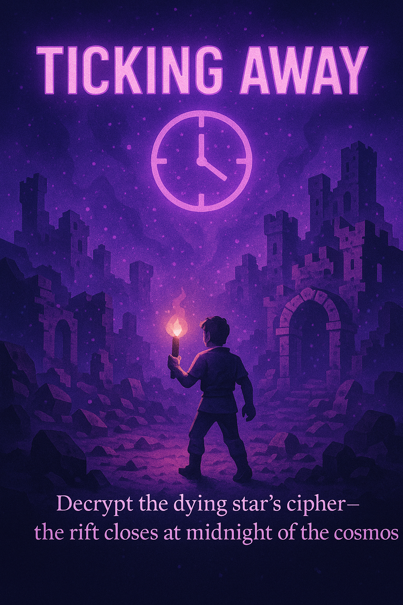
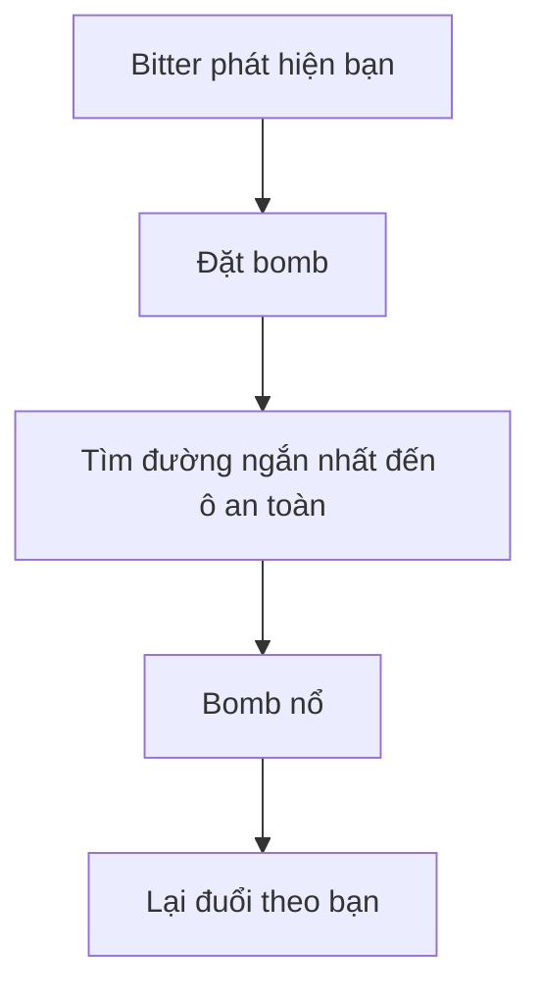
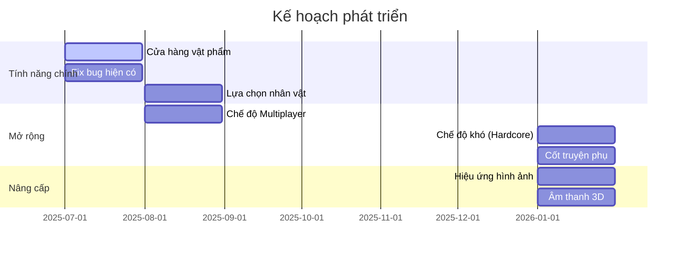
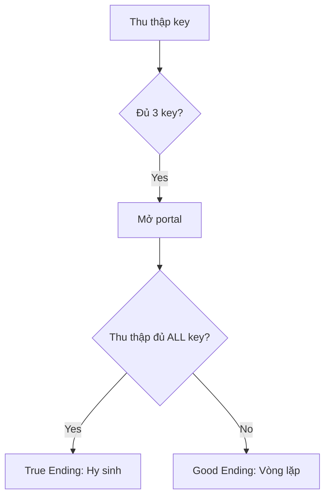
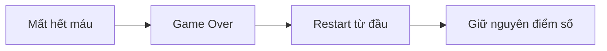
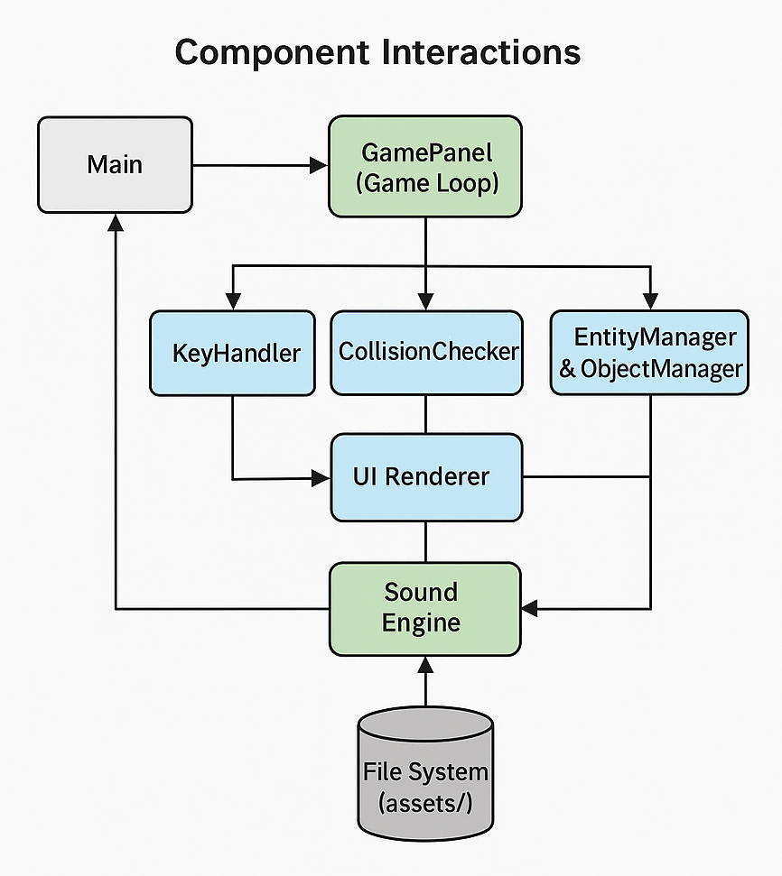
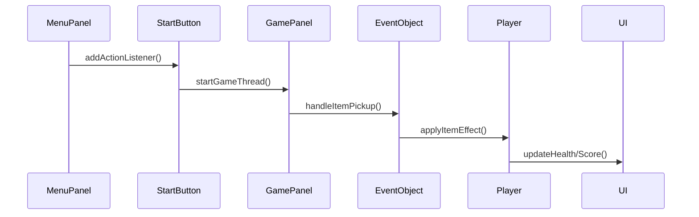

# ⏳ **TICKING AWAY** 🔥  
<div align="center">
  
  <br>
  <em>Decrypt the dying star's cipher - the rift closes at midnight of the cosmos</em>
</div>

---

## 🧭 "You wake up in the dark... with only a flickering torch in hand."  
## 🧩 *TICKING AWAY – The Flame and the Forgotten*

---

### 🕯️ **Lời thì thầm trong bóng tối:**

*"You wake up in the dark... with only a flickering torch in hand."*

Bạn tỉnh dậy giữa không gian vô tận, mờ mịt và lạnh lẽo. Không nhớ tên, không nhớ tại sao ở đây - chỉ có **ngọn đuốc yếu ớt** trong tay và cảm giác kỳ lạ rằng... bạn không thuộc về nơi này.

Trong tâm trí vang vọng lệnh:
> "**Tìm chìa khóa. Mở cánh cửa. Thoát khỏi nơi này.**"

Trước mắt là **mê cung đá cổ** đổ nát, tăm tối - thế giới dệt bằng ký ức méo mó và thực tại đứt gãy. Những **sinh vật gớm ghiếc** luẩn quẩn trong bóng tối, chờ cơ hội vồ lấy ánh sáng cuối cùng của bạn.

---

### 💣 **Cơ chế Bomb - Sinh tử trong từng bước chân**

Bạn có khả năng tạo bomb từ hư vô, nhưng phải trả giá đắt:

| Cơ chế | Mô tả | Rủi ro |
|--------|-------|--------|
| 💣 **Chỉ đặt bomb khi di chuyển** | Bomb chỉ được kích hoạt khi bạn đang di chuyển | Phơi bày vị trí cho enemy |
| 🚶 **An toàn khi đứng yên** | Khi đứng im, enemy không gây sát thương dù chạm vào bạn | Bị bao vây, không thể phòng thủ |
| ⚡ **Đánh đổi chiến thuật** | Di chuyển để đặt bomb ➔ Nguy hiểm<br>Đứng yên để an toàn ➔ Bất lực | Buộc chọn lựa sinh tử mỗi giây |

---

### 👾 **Thế giới quái vật - Mỗi loại một nỗi khiếp đảm riêng**

#### 🍉 Watermelon (HP: 3)
- **Định vị**: Chỉ phát hiện bạn khi bạn **di chuyển**
- **Hành vi**: Khi bạn đứng im ➔ Mất dấu ➔ Di chuyển ngẫu nhiên
- **Đặc điểm**: Máu cao, bị **stun 1s** khi trúng bomb

#### 🍬 Sweet (HP: 1)
- **Khả năng đặc biệt**: Đi xuyên mọi vật thể (trừ bomb)
- **Tốc độ**: Cao, xuất hiện bất ngờ như bóng ma
- **Cơ chế truy đuổi**: Theo bạn ngay khi vào phạm vi cảm nhận

#### 🍫 Bitter (HP: 5) - Kẻ săn mồi thông minh


---

### 📦 **Hệ thống Chest - Cơ hội và rủi ro**

#### 🧰 Chest 1 (Ô trắng - Hiếm)
- **Phần thưởng**: Random 1 trong 6 vật phẩm:
  - ⚡ Buff (3 loại): Tăng sáng/Tăng máu/Tăng sát thương bomb
  - 🧨 Debuff (3 loại): Giảm tốc/Dịch chuyển/Tăng thời gian hồi bomb

#### 🗝️ Chest 2 (Ô tím - Phổ biến)
| Vật phẩm | Tỉ lệ | Hiệu ứng |
|----------|-------|----------|
| 💡 Tăng phạm vi sáng | Cao (70%) | Mở rộng vùng ánh sáng |
| 🐌 Giảm tốc độ | Thấp (20%) | Di chuyển chậm 30% trong 10s |
| ✨ Dịch chuyển | Rất thấp (10%) | Teleport đến vị trí ngẫu nhiên |

---

### 🧠 **Cốt truyện - Bản ngã bị lãng quên**

> **Cảm hứng**: The Backrooms - Nỗi ám ảnh không lối thoát

| Phát hiện | Ý nghĩa |
|-----------|---------|
| 🔑 Thu thập đủ key | Mở portal thoát khỏi mê cung |
| 💡 True Ending | Thu thập **tất cả key** ➔ Nhận ra mình là quái vật ➔ Hy sinh phá hủy portal |
| 🔁 Good Ending | Chỉ cần 3 key ➔ Thoát ra nhưng **mất trí nhớ** ➔ Lặp lại vĩnh viễn |
| 💀 Game Over | Chết ➔ Hồi sinh tại điểm bắt đầu |

---

### 🎯 **Hệ thống điểm thưởng**

| Hành động | Điểm thưởng |
|-----------|-------------|
| Phá đá | +10 điểm |
| Diệt Watermelon | +100 điểm |
| Diệt Sweet | +50 điểm |
| Diệt Bitter | +200 điểm |
| Win game | +50,000 điểm |

---

### 🔮 **Lộ trình phát triển tương lai**


---

### 🎨 **Nguồn tài nguyên**
| Loại | Nguồn | Mô tả |
|------|-------|-------|
| Tile set | [Cosmic Lilac](https://petricakegames.itch.io/cosmic-lilac) | Bộ tile set không gian huyền ảo |
| Âm thanh | [MyInstants](https://www.myinstants.com/en/instant/bugs-crawling-38179/) | Hiệu ứng âm thanh rùng rợn |
| Cốt truyện | The Backrooms | Cảm hứng về không gian vô tận |

---

## 🧩 **CƠ CHẾ WIN/GAME OVER**

### 🏆 Chiến thắng


### ☠️ Thất bại


---

## 🎮 **Hướng dẫn chơi nâng cao**
1. **Chiến thuật bomb**: Di chuyển theo hình vuông ➔ Đặt bomb tại góc ➔ Trở lại vị trí an toàn
2. **Đối phó Bitter**: Dụ nó đặt bomb ➔ Lừa vào khu vực hẹp ➔ Dùng bomb của nó tiêu diệt nó
3. **Quản lý ánh sáng**: Ưu tiên mở chest tím ➔ Duy trì phạm vi sáng tối đa
4. **Khai thác Sweet**: Dùng bomb chặn lối ➔ Buộc nó đi vào vùng nổ

> "**Ánh sáng mong manh - Hi vọng mong manh - Nhưng ý chí phải bất diệt**"
---


# 🛠️ **Technologies**
<div align="center">
  
  <br>
  <em>📐 UML Class Diagram - Modular Design Pattern</em>
</div>

### 🧩 Tech Stack Breakdown  
| Công nghệ       | Ứng dụng trong game                | Phiên bản |
|-----------------|------------------------------------|----------|
| ☕ **Java**      | Core game logic, AI system         | 17 LTS   |
| 🖼️ **AWT/Swing**| Rendering engine, UI components    | 1.2      |
| 🤖 **A***       | Pathfinding for enemy movement     | -        |
| 📦 **OOP**      | Entity-component system design     | -        |

---

## 📂 **CẤU TRÚC DỰ ÁN NÂNG CAO**
### 🗃️ Package Structure
```
📁 src/
├── 📁 main/ # Lõi game
│ ├── UI.java 		            📊 Hiển thị máu, thời gian, điểm
│ ├── EventObject.java 	        ⚡ Xử lý tương tác vật phẩm
│ ├── Main.java 	            🚀 Khởi tạo JFrame
│ ├── MenuPanel.java 	        🖼️ Màn hình menu chính
│ ├── UtilityTool.java 	        🛠️ Công cụ load ảnh/xử lý file
│ ├── AssetSetter.java 	        🖼️ Trình tải tài nguyên
│ ├── CollisionChecker.java     🚧 Hệ thống va chạm
│ ├── GamePanel.java 	        🎮 Vòng lặp game chính
│ ├── KeyHandler.java 	        ⌨️ Xử lý đầu vào
│ ├── GradientTitleLabel.java   ⌨️ Vẽ Title
│ ├── BufferedNameEffect.java   🖼️ Xử lý hiệu ứng hình ảnh
│ ├── MainFrame.java 	        🎮 Xử lý thay đổi màn hình
│ └── Sound.java 	            🔊 Quản lý âm thanh

├── 📁 entity/ # Nhân vật
│ ├── Entity.java 	            👤 Lớp cơ sở
│ └── Player.java 	            🧍 Điều khiển người chơi

├── 📁 enemy/ # Hệ thống AI kẻ thù
│ ├── E_Bitter.java 	        🍫 Logic kẻ địch Bitter
│ ├── E_Sweet.java 	            🍬 Logic kẻ địch Sweet
│ ├── E_Watermelon.java         🍉 Logic kẻ địch Watermelon
│ ├── EnemyBehavior.java        🤖 Máy trạng thái AI
│ ├── Node.java                 📊 Hỗ trợ thuật toán A*
│ └── PathFinder.java 	        🧭 Triển khai thuật toán A*

├── 📁 object/ # Vật thể tương tác
│ ├── 📁 buffitems/     ⚡ Vật phẩm tăng sức mạnh
│ │ ├── IncreaseDamage.java 	💥 Tăng sát thương bom
│ │ ├── IncreaseHealth.java 	❤️ Tăng máu
│ │ └── IncreaseLight.java 	    💡 Tăng phạm vi ánh sáng
│ │
│ ├── 📁 debuffitems/   🧨 Vật phẩm gây bất lợi
│ │ ├── DecreaseBomb.java 	    💣 Tăng thời gian hồi bomb
│ │ ├── DecreaseSpeed.java 	    🐌 Giảm tốc độ
│ │ └── Teleport.java 		    📖 Dịch chuyển ngẫu nhiên
│ │
│ ├── Bomb.java 	            💣 Hệ thống bom nổ
│ ├── Flame.java 	            💥 Hệ thống lửa
│ ├── Key.java 	                🔑 Chìa khóa mở Portal
│ ├── Portal.java 	            🧩 Điều kiện để thắng
│ ├── SuperObject.java 	        🤖 Logic object chung
│ └── Chest.java 	            🎁 Rương chứa vật phẩm

└── 📁 tile/ # Hệ thống bản đồ
├── Tile.java 		            🧱 Logic tile đơn lẻ
└── TileManager.java 	        🗺️ Trình render toàn bản đồ

```

---

## 🧩 **THÀNH PHẦN CHÍNH - ĐIỂM NỔI BẬT TRONG CODE**

### 🎮 **Hệ thống UI với hiệu ứng động phức tạp**
```java
// Vẽ hiệu ứng bóng tối động với gradient radial
public void drawDarknessEffect(Graphics2D g2, int centerX, int centerY, int radius) {
    BufferedImage darkness = new BufferedImage(screenWidth, screenHeight, BufferedImage.TYPE_INT_ARGB);
    Graphics2D gDark = darkness.createGraphics();
    int totalRadius = radius + player.bonusLightRadius;
    
    // Tạo gradient cho ánh sáng
    gDark.setPaint(new RadialGradientPaint(
        new Point(centerX, centerY),
        totalRadius,
        new float[]{0f, 1f},
        new Color[]{new Color(0, 0, 0, 1f), new Color(0, 0, 0, 0f)}
    ));
    
    // Vẽ hiệu ứng
    gDark.fillOval(centerX - totalRadius, centerY - totalRadius, totalRadius * 2, totalRadius * 2);
    g2.drawImage(darkness, 0, 0, null);
}

// Hiệu ứng mở đầu game với fade-in + flash
private void drawStartEffect(Graphics2D g2) {
    long elapsed = System.currentTimeMillis() - effectStartTime;
    
    // Fade in từ đen
    if (elapsed < FADE_IN_DURATION) {
        float progress = (float) elapsed / FADE_IN_DURATION * 0.5f;
        float opacity = 1.0f - progress * progress;
        g2.setColor(new Color(0, 0, 0, opacity));
        g2.fillRect(0, 0, screenWidth, screenHeight);
    }
    // Hiệu ứng flash trắng
    else if (flashCount < 2) {
        // ...
    }
}
```

### ⚡ **Cơ chế đặt bomb chỉ khi di chuyển**
```java
// Trong Player.java
public void update() {
    // Chỉ được đặt bomb khi đang di chuyển
    if (keyH.spacePressed && bombCooldown <= 0 && (moving || !wasTouchingEnemy)) {
        placeBomb();
    }
    
    // Bất tử khi đứng yên
    if (!moving) {
        invincibleCounter = 1; // Luôn bật invincible
    } else {
        invincibleCounter = 0; // Tắt invincible
    }
}
```

### 🧠 **AI Enemy Bitter phức tạp**
```java
// Trong E_Bitter.java
public void update() {
    // State Machine cho AI
    switch (aiState) {
        case ESCAPE:
            if (!isNearBomb() && !isNearFlame()) {
                aiState = State.CHASE;
            } else {
                escapeFromDanger(); // Tìm đường thoát hiểm
            }
            break;
            
        case CHASE:
            if (isNextToPlayer && bombCooldown <= 0) {
                // Kiểm tra có đường thoát trước khi đặt bomb
                if (hasEscapeRouteAfterPlacingBomb(bombCol, bombRow)) {
                    placeBomb();
                    aiState = State.ESCAPE;
                }
            }
            break;
    }
    
    // Thuật toán A* tìm đường
    private void calculateAStarPath() {
        PathFinder pf = new PathFinder(gp);
        List<Node> path = pf.findPath(startCol, startRow, goalCol, goalRow, false);
        if (path != null) pathList = path;
    }
}
```

### 📦 **Hệ thống vật phẩm với hiệu ứng tạm thời**
```java
// Trong EventObject.java
private void applyBombRangeEffect(int itemIndex) {
    // Tăng phạm vi bomb tạm thời
    player.tempBombRange = player.bombRange + 1;
    player.bombRangeExpireTime = System.currentTimeMillis() + 15000;
    
    // Timer reset hiệu ứng
    new java.util.Timer().schedule(new java.util.TimerTask() {
        @Override
        public void run() {
            player.tempBombRange = 0;
            player.bombRange = player.originalBombRange;
        }
    }, 15000);
}
```

### 🔥 **Cơ chế ánh sáng giảm dần theo thời gian**
```java
// Trong GamePanel.java
public void update() {
    timeElapsedFrames++;
    int durationFrames = FPS * 25; // 25 giây
    
    // Giảm dần bán kính ánh sáng
    if (timeElapsedFrames <= durationFrames) {
        float ratio = 1.0f - ((float)timeElapsedFrames / durationFrames);
        baseLightRadius = baseRadiusMin + (int)((baseRadiusMax - baseRadiusMin) * ratio);
    }
    
    // Hiệu ứng nhấp nháy
    flickerAngle += 0.1f;
    baseLightRadius += (int)(Math.sin(flickerAngle) * flickerAmplitude);
}
```

### 🎮 **Hệ thống chuyển đổi trạng thái game linh hoạt**
```java
// Trong MainFrame.java
public void switchToGame
```

## 🔗 **LUỒNG TƯƠNG TÁC CHÍNH**

---

## 📊 **THIẾT KẾ GIAO DIỆN**
| Thành phần           | Mô tả                          | Hình ảnh tham khảo       |
|------------------    |--------------------------------|--------------------------|
| Health Bar           | 4 trái tim hiển thị máu        | ❤️❤️❤️❤️               |
| Timer                | Đếm time giữa màn hình         | ⏳ 02:30                 |
| Key                  | Đếm số key đã nhặt được        | 🔑 x 3                  |
| Menu Button          | Nút trở về menu                | 🏁 Menu                 |
| Score Board          | Điểm số góc trái               | 💯 Score: 12,450        |
| Game Over/ Win Screen| Nền đen + thông báo            | 🎮 GAME OVER - Score: X |

---
