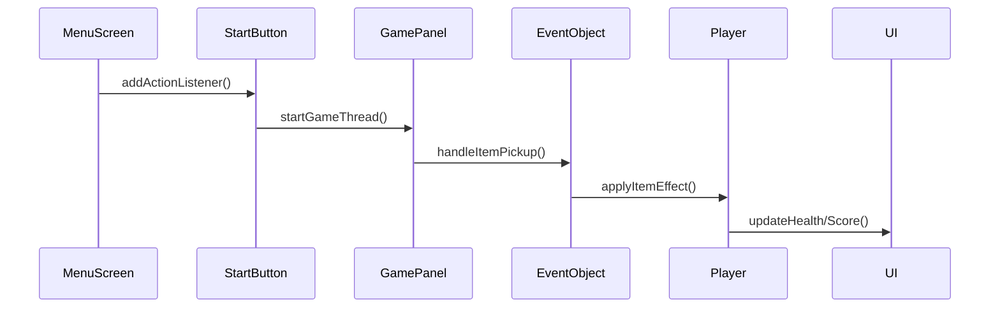

# ⏳ **TICKING AWAY** 🔥  
<div align="center">
  
  <br>
  <em>Decrypt the dying star's cipher - the rift closes at midnight of the cosmos</em>
</div>

---

## 🧭 "You wake up in the dark... with only a flickering torch in hand."  
## 🧩 Story – The Flame and the Forgotten  
Bạn tỉnh dậy trong một khoảng không gian u tối, vô tận, trí nhớ trống rỗng, chỉ còn lại ngọn đèn nhỏ run rẩy trên tay. Không rõ bạn là ai, nhưng trong tiềm thức luôn vang vọng một mục tiêu duy nhất:  

**"Tìm chìa khóa. Mở cánh cửa."**  

Trước mắt bạn là một lâu đài đổ nát, đá vụn chắn mất lối đi. Kỳ lạ thay, bạn nhận ra mình có khả năng tạo ra những quả bom từ hạt nguyên tử trong không khí – vô hạn, mạnh mẽ, và duy nhất bạn sở hữu được nó. Nhưng không chỉ có đá cản đường, những sinh vật dị dạng đang bủa vây, ẩn nấp trong bóng tối.  

🔥 **Ánh sáng mờ dần** theo từng phút trôi qua, bạn phải nhanh chóng:  
- Vượt qua mê cung tối tăm  
- Giải mã bí ẩn  
- Tìm ra cánh cổng thần bí  

---

## 🕹️ Gameplay Overview  
### 🎯 Objective  
Thoát khỏi mê cung trong bóng tối bằng cách:  
🔑 Thu thập đủ 2 chìa khóa để mở **Cánh cổng thần bí (portal)**  
💣 Dùng bomb để phá đá, tiêu diệt kẻ địch  
🕯️ Giữ ánh sáng bằng cách thắp lại ngọn đuốc  

### ⚙️ Game Mechanics  
#### 🌒 Tầm nhìn giới hạn:  
- Người chơi chỉ nhìn thấy xung quanh nhờ ánh sáng từ ngọn đuốc  
- ⏳ Cứ mỗi **15 giây**, phạm vi sáng sẽ giảm dần  
- 🔥 Tìm và thắp lại **Chest** để khôi phục ánh sáng  

#### 🧱 Vật cản:  
| Biểu tượng | Mô tả                  |
|------------|------------------------|
| 🧱         | Tường chắn (maze)      |
| 🗿         | Đá (phá bằng bomb)     |
| 👾         | Kẻ địch rình rập       |

#### 🎮 Kỹ năng người chơi:  
💣 Đặt bomb (nổ theo hình **dấu +**, bán kính 5 ô)  
🧨 Phá đá/tiêu diệt enemy  
👀 Tạo ánh sáng xung quanh  
🎁 Nhặt vật phẩm trong Chest  
🚪 Mở khóa portal khi đủ key  

---

## 📦 Items  
### ⚡ Buffed Items:  
| Item      | Hiệu ứng               |
|-----------|------------------------|
| 💎 Crystal | Tăng phạm vi sáng     |
| ⛑ Helmet | Tăng máu (giáp ảo)    |
| 🧪 Potion | Tăng phạm vi nổ bomb  |

### 🧨 Debuffed Items:  
| Item      | Hiệu ứng               |
|-----------|------------------------|
| 📖 Book   | Dịch chuyển ngẫu nhiên |
| 🍬 Candy  | Làm chậm tốc độ       |
| 📜 Scroll | Tăng thời gian hồi bomb |

---

## 👾 Enemies  
### 🍉 Watermelon (HP: 3)  
- Hiện hình khi bạn **đứng yên**  
- Tàng hình khi bạn **di chuyển**  
- Bị **stun 1s** khi trúng bomb  

### 🍬 Sweet (HP: 1)  
- Di chuyển xuyên qua mọi vật thể  
- Tốc độ cao & xuất hiện bất ngờ  

### 🍫 Bitter (HP: 5)  
- Có thể **đặt bomb** như người chơi  
- Bám đuổi dai dẳng + tốc độ cao  

---

## 🧍‍♂️ UI & HUD  
❤️ **Health**: 4 mạng  
🧠 **Score**: Tính theo:  
- Kẻ địch tiêu diệt (nhiều điểm)  
- Đá bị phá (ít điểm hơn)  
- Thời gian hoàn thành  

⏱️ **Time**: Càng lâu trong mê cung → ánh sáng càng thu hẹp!  

---

## 🧨 Bomb System  
- Tạo bomb **vô hạn**  
- Nổ theo hình **dấu +**  
- Kết hợp với **Potion** để mở rộng tầm nổ  

---

## ✨ Why "TICKING AWAY"?  
> **Bạn đang chạy đua với:**  
> - ⏳ Thời gian  
> - 🌑 Bóng tối  
> - 👻 Những mảnh ký ức tan biến...  
> *"Chỉ còn ánh sáng le lói cuối cùng dẫn đường"*  

---

## 🏁 End Goal  
Khi mở được **portal**, bạn sẽ khám phá:  
- Sự thật về thân phận của bạn?  
- Hay một thế giới **tăm tối hơn**?  

---

## 🛠️ Technologies  
<div align="center">
  
  <br>
  <em>📐 UML Class Diagram - Modular Design Pattern</em>
</div>

### 🧩 Tech Stack Breakdown  
| Công nghệ       | Ứng dụng trong game                | Phiên bản |
|-----------------|------------------------------------|----------|
| ☕ **Java**      | Core game logic, AI system         | 17 LTS   |
| 🖼️ **AWT/Swing**| Rendering engine, UI components    | 1.2      |
| 🤖 **A***       | Pathfinding for enemy movement     | -        |
| 📦 **OOP**      | Entity-component system design     | -        |

---

## 📂 **CẤU TRÚC DỰ ÁN NÂNG CAO**
### 🗃️ Package Structure
```
📁 src/
├── 📁 button/ # Hệ thống nút bấm
│ ├── Button.java	 🖱️ Lớp trừu tượng xử lý hover/click
│ ├── StartButton.java 	▶️ Khởi tạo game khi nhấn
│ └── UnMuteButton.java 🔇 Bật/tắt âm thanh

├── 📁 main/ # Lõi game
│ ├── UI.java 		📊 Hiển thị máu, thời gian, điểm
│ ├── EventObject.java 	⚡ Xử lý tương tác vật phẩm
│ ├── Main.java 	🚀 Khởi tạo JFrame
│ ├── MenuScreen.java 	🖼️ Màn hình menu chính
│ ├── UtilityTool.java 	🛠️ Công cụ load ảnh/xử lý file
│ ├── AssetSetter.java 	🖼️ Trình tải tài nguyên
│ ├── CollisionChecker.java 🚧 Hệ thống va chạm
│ ├── GamePanel.java 	🎮 Vòng lặp game chính
│ ├── KeyHandler.java 	⌨️ Xử lý đầu vào
│ └── Sound.java 	🔊 Quản lý âm thanh

├── 📁 entity/ # Nhân vật
│ ├── Entity.java 	👤 Lớp cơ sở
│ └── Player.java 	🧍 Điều khiển người chơi

├── 📁 enemy/ # Hệ thống AI kẻ thù
│ ├── E_Bitter.java 	🍫 Logic kẻ địch Bitter
│ ├── E_Sweet.java 	🍬 Logic kẻ địch Sweet
│ ├── E_Watermelon.java 🍉 Logic kẻ địch Watermelon
│ ├── EnemyBehavior.java 🤖 Máy trạng thái AI
│ └── PathFinder.java 	🧭 Triển khai thuật toán A*

├── 📁 object/ # Vật thể tương tác
│ ├── 📁 buffitems/ ⚡ Vật phẩm tăng sức mạnh
│ │ ├── IncreaseDamage.java 	💥 Tăng sát thương bom
│ │ ├── IncreaseHealth.java 	❤️ Tăng máu
│ │ └── IncreaseLight.java 	💡 Tăng phạm vi ánh sáng
│ │
│ ├── 📁 debuffitems/ 🧨 Vật phẩm gây bất lợi
│ │ ├── DecreaseBomb.java 	🌑 Tăng thời gian hồi bomb
│ │ ├── DecreaseSpeed.java 	🐌 Giảm tốc độ
│ │ └── Teleport.java 		📖 Dịch chuyển ngẫu nhiên
│ │
│ ├── Bomb.java 	💣 Hệ thống bom nổ
│ ├── Flame.java 	💥 Hệ thống lửa
│ └── Chest.java 	🎁 Rương chứa vật phẩm

└── 📁 tile/ # Hệ thống bản đồ
├── Tile.java 		🧱 Logic tile đơn lẻ
└── TileManager.java 	🗺️ Trình render toàn bản đồ

```

---

## 🧩 **THÀNH PHẦN CHÍNH**

### 🎮 **Hệ thống UI**
```java
public class UI {
    // Hiển thị thanh máu
    private void drawHealthBar(Graphics2D g2) {
        for (int i = 0; i < gp.player.maxHealth; i++) {
            if (i < gp.player.health) {
                g2.drawImage(heart, x, y, size, size, null);
            }
        }
    }

    // Cập nhật điểm số
    public void addScore(int points) {
        visibleScore += points;
    }
}
```
**Chức năng:**  
- Hiển thị 4 trái tim biểu thị máu  
- Đếm thời gian dạng `mm:ss`  
- Hiển thị điểm số real-time  
- Màn hình kết thúc game (Thắng/Thua)

### 🎯 **Xử lý sự kiện (EventObject)**
```java
public class EventObject {
    public void handleItemPickup(int index) {
        if (item instanceof IncreaseDamage) {
            player.bombRange = Math.max(player.bombRange, 2);
        }
        else if (item instanceof Teleport) {
            teleportPlayerToRandomLocation();
        }
    }
}
```
**Logic chính:**  
- Tăng phạm vi bomb khi nhặt `IncreaseDamage`  
- Teleport ngẫu nhiên khi nhặt `Teleport`  
- Giảm tốc độ tạm thời với `DecreaseSpeed`
- ... 
- Mở chest sinh vật phẩm ngẫu nhiên

### 🖥️ **Menu hệ thống**
```java
public class MenuScreen extends JPanel {
    // Tương tác với các nút
    public void add(StartButton startBtn) {
        startBtn.addActionListener(e -> {
            gp.startGameThread();
            setVisible(false);
        });
    }
}
```
**Flow chính:**  
1. Hiển thị background + animation  
2. Xử lý click nút Start/Unmute  
3. Chuyển đổi giữa các trạng thái game

---

## 🔗 **LUỒNG TƯƠNG TÁC CHÍNH**


---

## 🛠️ **CÔNG CỤ & KỸ THUẬT**

### 🖼️ UtilityTool.java
```java
public class UtilityTool {
    public BufferedImage scaleImage(BufferedImage original, int width, int height) {
		
		BufferedImage scaledImage = new BufferedImage(width, height, 2);
		Graphics2D g2 = scaledImage.createGraphics();
		g2.drawImage(original, 0, 0, width, height, null);
		g2.dispose();
		
		return scaledImage;
	}
}
```

### 🎛️ Main.java
```java
public class Main {
    public static void main(String[] args) {
        
        JFrame window = new JFrame();
        window.setDefaultCloseOperation(JFrame.EXIT_ON_CLOSE);
        window.setResizable(false);
        window.setTitle("Ticking Away");

        SwingUtilities.invokeLater(() -> {
            new MenuScreen().setVisible(true);
        });

        window.pack();

        window.setLocationRelativeTo(null);
        window.setVisible(true);
    }
}
```

---

## 📊 **THIẾT KẾ GIAO DIỆN**
| Thành phần       | Mô tả                          | Hình ảnh tham khảo       |
|------------------|--------------------------------|--------------------------|
| Health Bar       | 4 trái tim hiển thị máu        | ❤️❤️❤️❤️               |
| Timer            | Đếm time giữa màn hình        | ⏳ 02:30                 |
| Score Board      | Điểm số góc trái               | 💯 Score: 12,450        |
| Game Over Screen | Nền đen + thông báo            | 🎮 GAME OVER - Score: X |

---
